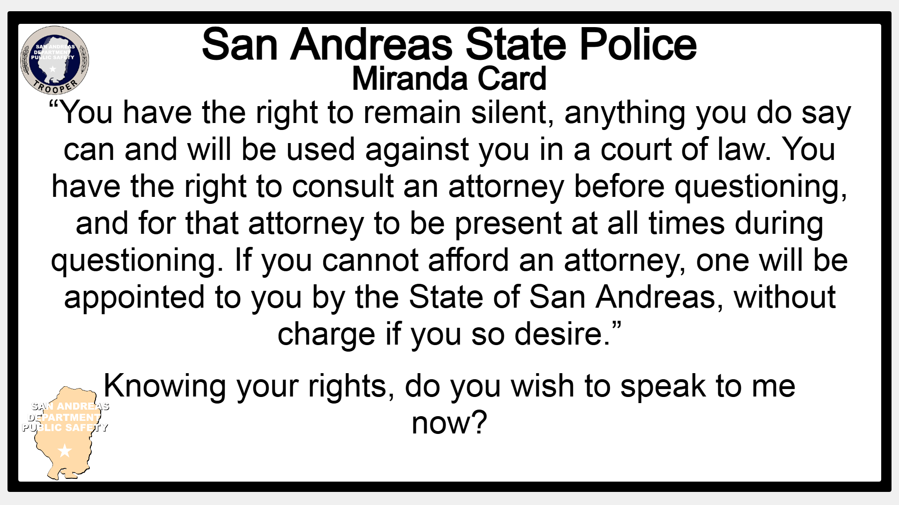

# 5.13 - Detainment and Arrest

When a person is detained, they shall be informed by the Trooper that they are being detained. Should that person ask at any time if they are being detained, the Trooper shall inform them that they are being detained and for what reason. Unless the reason would provoke a risk to Trooper or others.

Members of the public shall only be detained when one or more of the following conditions are met:

* The Trooper has a reasonable suspicion that said person has or is about to commit a crime.
* The Trooper has probable cause to show that said person has committed, is about to commit or intends to commit a crime.
* The suspect has agreed to be detained as requested by the Trooper. Should a member of the public who has agreed to be detained as requested by an Trooper no longer wish to be detained, that person shall be released from detainment at the soonest reasonable opportunity the Trooper may have to release them from detainment unless said Trooper has developed a reasonable suspicion or probable cause to keep them detained.
* A Trooper may only place a suspect under arrest if the Trooper has probable cause to show that the suspect has committed, is about to commit, or intends to commit a crime and thus breach a state or federal law or ordinance. Once a suspect is placed under arrest, the Trooper shall transport them (or organize transport for them) to a holding or processing facility at the earliest reasonable time. An Trooper may keep them on scene for questioning, however once questioning has ceased, they shall make efforts to transport them in an expedient manner.

After a suspect is placed under arrest, and before that suspect is questioned, they must be read their Miranda rights. The Miranda warning shall be read to them verbatim, as so:

**“You have the right to remain silent, anything you do say can and will be used against you in a court of law. You have the right to consult an attorney before questioning, and for that attorney to be present at all times during questioning. If you cannot afford an attorney, one will be appointed to you by the State of San Andreas, without charge if you so desire.”**&#x20;

Once the Miranda warning has been read to a suspect, an affirmative understanding and waiving of these rights shall be sought. **“Do you understand these rights as I have read them to you?”**

“Knowing your rights, do you wish to speak to me now?” Individuals may invoke their rights at any time with verbal confirmation. Their reinitiating of direct contact pertaining to the crime waives this invoke.

<figure><figcaption>
Miranda Card
</figcaption></figure>
